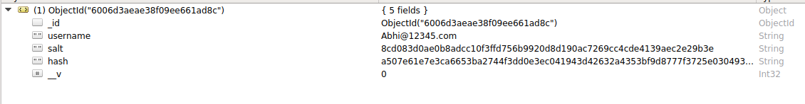
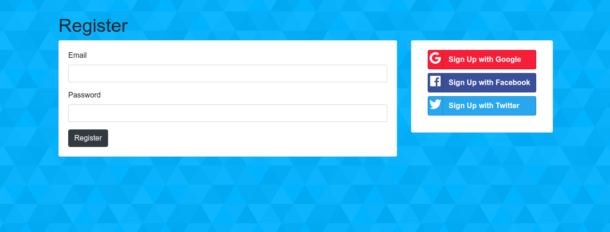

# Sign Up, Sign In Rest Api


<!-- TABLE OF CONTENTS -->
<details open="open">
  <summary>Table of Contents</summary>
  <ol>
    <li>
      <a href="#about-the-project">About The Project</a>
      <ul>
        <li><a href="#built-with">Built With</a></li>
        <ul>
        <li><a href="#npm-packages">NPM Packages</a></li>
      </ul>
      </ul>
    </li>
    <li>
      <a href="#features">Features</a>
    </li>
    <li>
      <a href="#environmental-variables">Environmental Variables</a>
    </li>
    <li>
      <a href="#how-to-build-and-run-the-project">How to Build and Run the project</a>
    </li>
    <li>
		<a  href="#screenshots">Screenshots</a>
		<ul>
			<li><a  href="#register-page">Register Page</a></li>
	</ul>
</li>
  </ol>
</details>

---
<!-- ABOUT THE PROJECT -->
## About The Project

 - Project delivers an API to register and login an user. User's signin password is encrypted using hashing and salting. Therefore only the hash and salt will be stored in database with their email.
 - Simple Frontend UI is made using ejs(Embedded JavaScript templating). 
 - Google OAuth is also used for the users who wants to signin using OAuth.
  
### Built With

-   [Mongo](https://www.mongodb.com/) 4.4.0+
-   [Node](https://nodejs.org/en/) 14.15.4+ (It's recommended to use 14.15.4 LTS)

#### NPM packages:

 - [ExpressJS](https://www.npmjs.com/package/express) 
 - [Mongoose](https://www.npmjs.com/package/mongoose)
 - [ejs](https://www.npmjs.com/package/ejs)
 - [body-parser](https://www.npmjs.com/package/body-parser)
 - [Passport](https://www.npmjs.com/package/passport)
 - [Passport-local](https://www.npmjs.com/package/passport-local)
 - [Passport-local-mongoose](https://www.npmjs.com/package/passport-local-mongoose)
 - [Passport-google-oauth20](https://www.npmjs.com/package/passport-google-oauth20)
 - [Mongoose-findorcreate](https://www.npmjs.com/package/mongoose-findorcreate)
 - [Express-session](https://www.npmjs.com/package/express-session)

---

## Features
 - Sign In and Sign Up Securely.
 - Hash and Salt password before storing to database.
 - Save the session and cookie once SignedIn or SignedUp.
 - Google authentication (Login and Logout with google) and authorization.
 - #### Database Document
 
 

---
 ## Environmental Variables

We already required and configured dotenv.

```javascript
require('dotenv').config()
```

Create a `.env` file in the root directory of the project. Add
environment-specific variables on new lines in the form of `KEY=VALUE`.
We need these environment variables:

```dosini
GOOGLE_CLIENT_ID=google client id for OAuth
```

`process.env` now has the keys and values you defined in your `.env` file.

---
 ## How to Build and Run the project

  

1. Install NPM packages

```sh

npm install

```

2. Setup Local MongoDB Connection at port 27017

```sh

mongod

```


3. Run Server 

```sh

node server.js

```

---
## Screenshots

### Register Page


